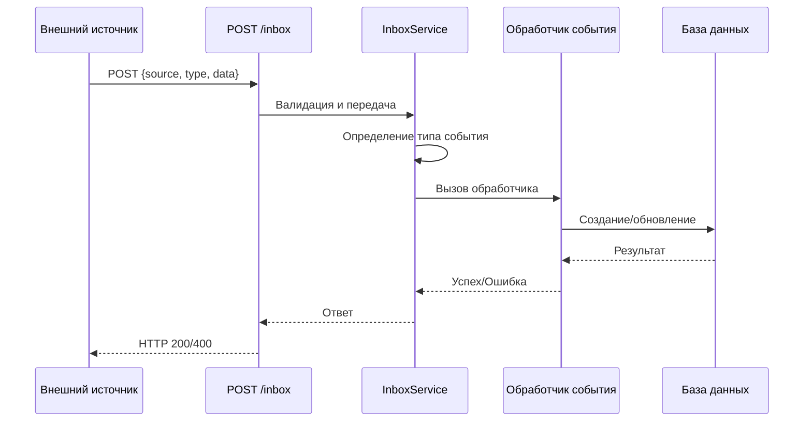

# Inbox — Единая точка входа для входящих событий

Документация по использованию Inbox API в WorkHub для обработки событий из различных источников (Telegram, GitHub, Webhooks и т.д.).

## Содержание

- [Обзор](#обзор)
- [Архитектура](#архитектура)
- [API Endpoint](#api-endpoint)
- [Формат запросов](#формат-запросов)
- [Поддерживаемые источники](#поддерживаемые-источники)
- [Типы событий](#типы-событий)
- [Примеры использования](#примеры-использования)
- [Обработка ошибок](#обработка-ошибок)
- [Интеграция с Telegram](#интеграция-с-telegram)

## Обзор

Inbox — это единая точка входа (`POST /inbox`) для обработки входящих событий из различных внешних источников. Все события проходят через один endpoint, что упрощает:

- **Централизованную обработку** — единый формат для всех интеграций
- **Маршрутизацию событий** — автоматическое определение типа события и его обработка
- **Расширяемость** — легко добавлять новые источники и типы событий
- **Аудит** — все события логируются с указанием источника

### Принцип работы

```
Внешний источник → POST /inbox → InboxService → Обработчик события → Создание/обновление данных
```

## Архитектура

### Компоненты

1. **InboxController** (`src/inbox/inbox.controller.ts`)
   - Принимает HTTP запросы на `POST /inbox`
   - Валидирует структуру запроса
   - Передает запрос в InboxService

2. **InboxService** (`src/inbox/inbox.service.ts`)
   - Определяет тип события
   - Маршрутизирует к соответствующему обработчику
   - Обрабатывает ошибки

3. **DTO** (`src/inbox/dto/inbox-request.dto.ts`)
   - Определяет структуру запроса
   - Валидация данных

### Поток обработки



## API Endpoint

### POST /inbox

Единая точка входа для всех входящих событий.

**URL:** `http://localhost:3000/inbox`

**Метод:** `POST`

**Content-Type:** `application/json`

**Аутентификация:** Не требуется (для MVP)

## Формат запросов

### Базовая структура

```json
{
  "source": "telegram",
  "type": "task_create",
  "data": {
    "title": "Название задачи",
    "description": "Описание задачи",
    "projectId": "clx123...",
    "deadline": "2026-01-20T12:00:00.000Z"
  }
}
```

### Поля запроса

| Поле | Тип | Обязательное | Описание |
|------|-----|--------------|----------|
| `source` | `string` (enum) | Да | Источник события (см. [Поддерживаемые источники](#поддерживаемые-источники)) |
| `type` | `string` (enum) | Да | Тип события (см. [Типы событий](#типы-событий)) |
| `data` | `object` | Да | Данные события (зависит от типа) |

### Поля для `task_create`

| Поле | Тип | Обязательное | Описание |
|------|-----|--------------|----------|
| `title` | `string` | Да | Название задачи |
| `description` | `string` | Да | Описание задачи |
| `projectId` | `string` | Да | ID проекта (cuid) |
| `deadline` | `string` (ISO) | Нет | Дедлайн задачи в формате ISO 8601 |

## Поддерживаемые источники

### `telegram`

События от Telegram бота.

**Пример:**
```json
{
  "source": "telegram",
  "type": "task_create",
  "data": { ... }
}
```

### `github`

События от GitHub webhooks (планируется).

### `webhook`

Общие webhook события от внешних систем.

## Типы событий

### `task_create`

Создание новой задачи в проекте.

**Требуемые поля в `data`:**
- `title` (string) — название задачи
- `description` (string) — описание задачи
- `projectId` (string) — ID проекта
- `deadline` (string, опционально) — дедлайн в формате ISO 8601

**Пример:**
```json
{
  "source": "telegram",
  "type": "task_create",
  "data": {
    "title": "Исправить баг в авторизации",
    "description": "Пользователи не могут войти после обновления",
    "projectId": "clx123abc456",
    "deadline": "2026-01-25T18:00:00.000Z"
  }
}
```

## Примеры использования

### cURL

#### Создание задачи из Telegram

```bash
curl -X POST http://localhost:3000/inbox \
  -H "Content-Type: application/json" \
  -d '{
    "source": "telegram",
    "type": "task_create",
    "data": {
      "title": "Купить молоко",
      "description": "Не забыть купить молоко в магазине",
      "projectId": "clx123abc456",
      "deadline": "2026-01-21T20:00:00.000Z"
    }
  }'
```

#### Создание задачи без дедлайна

```bash
curl -X POST http://localhost:3000/inbox \
  -H "Content-Type: application/json" \
  -d '{
    "source": "telegram",
    "type": "task_create",
    "data": {
      "title": "Прочитать документацию",
      "description": "Изучить новый API",
      "projectId": "clx123abc456"
    }
  }'
```

### JavaScript/TypeScript

```typescript
const response = await fetch('http://localhost:3000/inbox', {
  method: 'POST',
  headers: {
    'Content-Type': 'application/json',
  },
  body: JSON.stringify({
    source: 'telegram',
    type: 'task_create',
    data: {
      title: 'Новая задача',
      description: 'Описание задачи',
      projectId: 'clx123abc456',
      deadline: new Date('2026-01-25T18:00:00.000Z').toISOString(),
    },
  }),
});

const result = await response.json();
console.log(result);
```

### Python

```python
import requests
from datetime import datetime

url = "http://localhost:3000/inbox"
payload = {
    "source": "telegram",
    "type": "task_create",
    "data": {
        "title": "Новая задача",
        "description": "Описание задачи",
        "projectId": "clx123abc456",
        "deadline": datetime(2026, 1, 25, 18, 0, 0).isoformat() + "Z"
    }
}

response = requests.post(url, json=payload)
print(response.json())
```

## Обработка ошибок

### Успешный ответ

**HTTP Status:** `200 OK`

**Body:**
```json
{
  "success": true,
  "task": {
    "id": "clx789def012",
    "title": "Новая задача",
    "description": "Описание задачи",
    "deadline": "2026-01-25T18:00:00.000Z",
    "completed": false,
    "createdAt": "2026-01-20T10:30:00.000Z",
    "updatedAt": "2026-01-20T10:30:00.000Z"
  }
}
```

### Ошибки

#### 400 Bad Request — Неверный формат запроса

**Причины:**
- Отсутствуют обязательные поля (`source`, `type`, `data`)
- Неверный формат `source` или `type` (не из enum)
- Неверная структура `data`

**Пример ответа:**
```json
{
  "statusCode": 400,
  "message": [
    "source must be one of the following values: telegram, github, webhook",
    "data must be an object"
  ],
  "error": "Bad Request"
}
```

#### 400 Bad Request — Проект не найден

**Причина:** Указанный `projectId` не существует в базе данных.

**Пример ответа:**
```json
{
  "statusCode": 400,
  "message": "Project with id clx123abc456 not found",
  "error": "Bad Request"
}
```

#### 400 Bad Request — Неподдерживаемый тип события

**Причина:** Указанный `type` не поддерживается.

**Пример ответа:**
```json
{
  "statusCode": 400,
  "message": "Unsupported event type: task_update",
  "error": "Bad Request"
}
```

## Интеграция с Telegram

Telegram бот автоматически использует `/inbox` для создания задач. Пользователь взаимодействует с ботом через команду `/add`, а бот отправляет запрос на `/inbox`.

### Поток работы

1. Пользователь отправляет `/add` в Telegram
2. Бот показывает список проектов
3. Пользователь выбирает проект
4. Бот запрашивает название задачи
5. Бот запрашивает описание задачи
6. Бот запрашивает дедлайн (можно пропустить)
7. Бот отправляет `POST /inbox` с собранными данными
8. Задача создается в системе

### Формат запроса от Telegram бота

```json
{
  "source": "telegram",
  "type": "task_create",
  "data": {
    "title": "Название из Telegram",
    "description": "Описание из Telegram",
    "projectId": "clx123abc456",
    "deadline": "2026-01-25T18:00:00.000Z"
  }
}
```

## Расширение функциональности

### Добавление нового источника

1. Добавьте значение в enum `InboxSource` в `src/inbox/dto/inbox-request.dto.ts`:
   ```typescript
   export enum InboxSource {
     TELEGRAM = "telegram",
     GITHUB = "github",
     WEBHOOK = "webhook",
     SLACK = "slack", // Новый источник
   }
   ```

2. Используйте новый источник в запросах:
   ```json
   {
     "source": "slack",
     "type": "task_create",
     "data": { ... }
   }
   ```

### Добавление нового типа события

1. Добавьте значение в enum `InboxEventType`:
   ```typescript
   export enum InboxEventType {
     TASK_CREATE = "task_create",
     TASK_UPDATE = "task_update", // Новый тип
   }
   ```

2. Добавьте обработчик в `InboxService.processEvent()`:
   ```typescript
   switch (request.type) {
     case InboxEventType.TASK_CREATE:
       return this.handleTaskCreate(request);
     case InboxEventType.TASK_UPDATE:
       return this.handleTaskUpdate(request); // Новый обработчик
     // ...
   }
   ```

3. Реализуйте обработчик:
   ```typescript
   private async handleTaskUpdate(request: InboxRequestDto) {
     // Логика обновления задачи
   }
   ```

## Переменные окружения

Для работы inbox не требуются специальные переменные окружения. Endpoint доступен по умолчанию на порту, указанном в `PORT` (по умолчанию 3000).

## Мониторинг и логирование

Все события логируются в `InboxService`:

```
[InboxService] Processing event: source=telegram, type=task_create
[InboxService] Task created: id=clx789def012, projectId=clx123abc456, source=telegram
```

Логи можно просматривать в консоли приложения или настроить централизованное логирование.

## См. также

- [RBAC документация](./rbac.md) — управление доступом к проектам
- [Schema документация](./schema.md) — структура базы данных
- [Queues документация](./queues.md) — фоновые задачи и очереди

